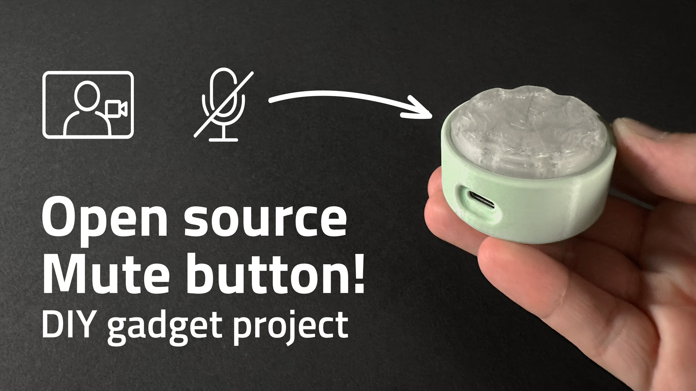

# MuteButton
DIY project to create a device capable of muting your computer.

{\rtf1\ansi\ansicpg1252\cocoartf2822
\cocoatextscaling0\cocoaplatform0{\fonttbl\f0\fswiss\fcharset0 Helvetica;\f1\fnil\fcharset0 AppleColorEmoji;\f2\fnil\fcharset134 PingFangSC-Regular;
\f3\froman\fcharset0 TimesNewRomanPSMT;\f4\froman\fcharset0 Times-Roman;}
{\colortbl;\red255\green255\blue255;}
{\*\expandedcolortbl;;}
\paperw11900\paperh16840\margl1440\margr1440\vieww31860\viewh16300\viewkind0
\pard\tx720\tx1440\tx2160\tx2880\tx3600\tx4320\tx5040\tx5760\tx6480\tx7200\tx7920\tx8640\pardirnatural\partightenfactor0

\f0\fs24 \cf0 # Open source Mute Button\
\
A hardware & software solution to control and monitor your microphone status during video calls.  \
Built as an **open source DIY project**, this mute button provides both **mute/unmute control** and **visual feedback** via LED indicators.\
\
---\
\
\pard\tx720\tx1440\tx2160\tx2880\tx3600\tx4320\tx5040\tx5760\tx6480\tx7200\tx7920\tx8640\pardirnatural\partightenfactor0
\cf0 - 
\f1 \uc0\u55356 \u57253 
\f0  [Watch on YouTube](https://youtu.be/E6khKvduem4)  \
\pard\tx720\tx1440\tx2160\tx2880\tx3600\tx4320\tx5040\tx5760\tx6480\tx7200\tx7920\tx8640\pardirnatural\partightenfactor0
\cf0 \
## 
\f1 \uc0\u55357 \u56534 
\f0  Project overview\
\
Video calls are now part of our daily lives. But who hasn\'92t experienced that awkward moment when someone forgets to mute, or tries to speak while still muted?  \
\
The **Mute Button** was designed to solve this issue by:  \
- Giving you **direct control over mic mute/unmute**  \
- Providing **real-time LED feedback** on mic status  \
- Allowing **volume adjustment** with a rotary encoder  \
- Being **100% open source**, so you can build, customize, and improve it\
\
This repository includes all design files: firmware, drivers, PCB, and 3D-printed enclosure.\
\
---\
\
## 
\f1 \uc0\u55358 \u56809 
\f0  Components\
\
### 1. Firmware & driver\
- **Firmware in C** for the PIC microcontroller  \
- **Driver in Python** to run on your computer and communicate with the mute button  \
- Includes **ready-to-use files** + editable source code  \
\
### 2. Hardware (PCB + electronics)\
- Microcontroller, encoder, USB-C port, LEDs, supporting components  \
- PCB specifications: **4-layer, 1.55 mm thickness**  \
- Includes:  \
  - **BOM (Bill of Materials)**  \
  - **Gerber files** for manufacturing  \
  - **Assembly guide (PDF)**  \
\
### 3. Enclosure (3D Printing)\
- Split into **two parts**: bottom base + translucent top cover  \
- Designed for FDM printing  \
- Files provided: **STL (ready to print)** + **STEP (editable)**  \
\
---\
\
## 
\f1 \uc0\u55357 \u56514 
\f0  Repository contents\
\
/hardware  \

\f2 \'a9\'c0
\f0 \uc0\u9472 \u9472  bom-mutebutton-v1.xls  \

\f2 \'a9\'c0
\f0 \uc0\u9472 \u9472  gerber-mutebutton-v1.zip  \

\f2 \'a9\'c0
\f0 \uc0\u9472 \u9472  assembly-mutebutton-v1.pdf  \
\
/enclosure  \

\f2 \'a9\'c0
\f0 \uc0\u9472 \u9472  mutebutton-v1-enclosuredesign.step  \

\f2 \'a9\'c0
\f0 \uc0\u9472 \u9472  mutebutton-v1-bottom.stl  \

\f2 \'a9\'c0
\f0 \uc0\u9472 \u9472  mutebutton-v1-top.stl  \
\
/firmware  \

\f2 \'a9\'c0
\f0 \uc0\u9472 \u9472  mutebutton-v1-firmware-microcontroller.hex    \

\f2 \'a9\'c0
\f0 \uc0\u9472 \u9472  mute-btn-systray_1.0.0 1.exe  \
\pard\pardeftab720\partightenfactor0

\f3 \cf0 \expnd0\expndtw0\kerning0
\uc0\u9492 \u9472 \u9472 
\f4  /sourcecode\
/images\

\f3 \uc0\u9500 \u9472 \u9472 
\f4  mutebutton-exploded-specs.jpg\

\f3 \uc0\u9500 \u9472 \u9472 
\f4  002-mutebutton-render.jpg\

\f3 \uc0\u9500 \u9472 \u9472 
\f4  001-mutebutton-render-exploded.jpg
\f0 \kerning1\expnd0\expndtw0 \
\pard\pardeftab720\partightenfactor0

\f3 \cf0 \expnd0\expndtw0\kerning0
\uc0\u9500 \u9472 \u9472 
\f4  opensource-mutebutton-diyproject.jpg
\f0 \kerning1\expnd0\expndtw0 \
\pard\tx720\tx1440\tx2160\tx2880\tx3600\tx4320\tx5040\tx5760\tx6480\tx7200\tx7920\tx8640\pardirnatural\partightenfactor0
\cf0 ---\
\
## 
\f1 \uc0\u55357 \u57056 
\f0  What you\'92ll need\
\
- 3D printer (or access to a printing service)  \
- **Translucent PLA** recommended for LED diffusion (top cover)  \
- PCB manufacturing service  \
- USB-c cable  \
- **Pickit programmer** for PIC firmware flashing ([Microchip link](https://www.microchip.com/en-us/development-tool/pg164150))  \
- C & Python development environments (optional, for code modifications)  \
- Soldering kit (if assembling PCB manually)  \
\
---\
\
## 
\f1 \uc0\u9881 \u65039 
\f0  Assembly instructions\
\
### Hardware & firmware\
1. Manufacture or order the PCB (Gerber provided)  \
2. Solder components following `assembly-mutebutton-v1.pdf` (skip if pre-assembled)  \
3. Connect via USB-C to power the board  \
4. Use **Pickit** to flash `mutebutton-v1-firmware-microcontroller.hex`  \
5. Install `mute-btn-systray_1.0.0 1.exe` on your computer  \
\
### Enclosure\
1. Print both STL files  \
2. Place PCB into the **bottom case** and align USB-C port  \
3. Secure with **2x plastic screws (\'d8 2 mm, 6 mm length)**  \
4. Snap on the **top cover**  \
5. Verify encoder rotation and button click responsiveness  \
\
---\
\
## 
\f1 \uc0\u9989 
\f0  Testing\
\
- Connect to your PC via USB-C  \
- Run common apps (Zoom, Google Meet, MS Teams)  \
- Test mute/unmute and volume control  \
- Verify LED correctly shows microphone status  \
\
---\
\
## 
\f1 \uc0\u55357 \u56615 
\f0  Customization\
\
- Modify the firmware (C) or driver (Python) to add new features  \
- Adjust 3D model (STEP file) to change dimensions or design  \
- Replace components in the BOM with alternatives as needed  \
\
---\
\
## 
\f1 \uc0\u55357 \u56599 
\f0  Resources & Links\
\
- 
\f1 \uc0\u55356 \u57253 
\f0  **Demo video & tutorial:** [Watch on YouTube](https://youtu.be/E6khKvduem4)  \
- 
\f1 \uc0\u55357 \u56560 
\f0  **Full blog article:** [Read on our blog](https://blackdevice.com/build-open-source-mute-button-video-calls/)  \
- 
\f1 \uc0\u55357 \u56514 
\f0  **blackdevice socials** [Linktree](https://linktr.ee/blackdevice)  \
- 
\f1 \uc0\u55357 \u56570 
\f0  **More projects:** [blackdevice YouTube channel](https://www.youtube.com/@ifblackdevice)  \
- 
\f1 \uc0\u55357 \u56556 
\f0  **Subscribe for updates:** [Join our mailing list](https://mailchi.mp/a7504efcb7de/subscribers)  \
\
---\
\
### Made with 
\f1 \uc0\u10084 \u65039 
\f0  by [blackdevice](https://blackdevice.com)}
