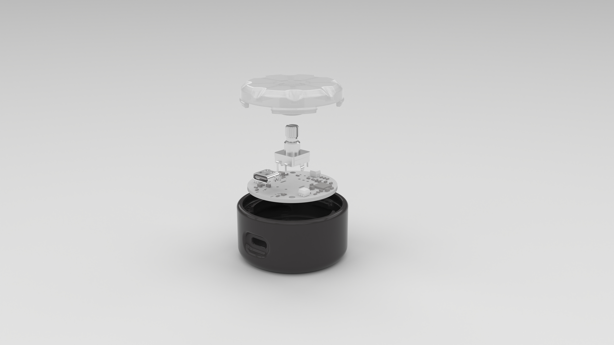

# Open source Mute Button

A hardware & software solution to control and monitor your microphone status during video calls.  
Built as an **open source DIY project**, this mute button provides both **mute/unmute control** and **visual feedback** via LED indicators.

---

- 🎥 [Watch on YouTube](https://youtu.be/E6khKvduem4)  

## 📖 Project overview

Video calls are now part of our daily lives. But who hasn’t experienced that awkward moment when someone forgets to mute, or tries to speak while still muted?  

The **Mute Button** was designed to solve this issue by:  
- Giving you **direct control over mic mute/unmute**  
- Providing **real-time LED feedback** on mic status  
- Allowing **volume adjustment** with a rotary encoder  
- Being **100% open source**, so you can build, customize, and improve it

This repository includes all design files: firmware, drivers, PCB, and 3D-printed enclosure.

---

## 🧩 Components

### 1. Firmware & driver
- **Firmware in C** for the PIC microcontroller  
- **Driver in Python** to run on your computer and communicate with the mute button  
- Includes **ready-to-use files** + editable source code  

### 2. Hardware (PCB + electronics)
- Microcontroller, encoder, USB-C port, LEDs, supporting components  
- PCB specifications: **4-layer, 1.55 mm thickness**  
- Includes:  
  - **BOM (Bill of Materials)**  
  - **Gerber files** for manufacturing  
  - **Assembly guide (PDF)**  

### 3. Enclosure (3D Printing)
- Split into **two parts**: bottom base + translucent top cover  
- Designed for FDM printing  
- Files provided: **STL (ready to print)** + **STEP (editable)**  

---

## 📂 Repository contents

/hardware  
-bom-mutebutton-v1.xls  
-gerber-mutebutton-v1.zip  
-assembly-mutebutton-v1.pdf  

/enclosure  
-mutebutton-v1-enclosuredesign.step  
-mutebutton-v1-bottom.stl  
-mutebutton-v1-top.stl  

/firmware  
-mutebutton-v1-firmware-microcontroller.hex    
-mute-btn-systray_1.0.0 1.exe  
-/sourcecode

/images  
-mutebutton-exploded-specs.jpg  
-002-mutebutton-render.jpg  
-001-mutebutton-render-exploded.jpg  
-opensource-mutebutton-diyproject.jpg  

---

## 🛠 What you’ll need

- 3D printer (or access to a printing service)  
- **Translucent PLA** recommended for LED diffusion (top cover)  
- PCB manufacturing service  
- USB-c cable  
- **Pickit programmer** for PIC firmware flashing ([Microchip link](https://www.microchip.com/en-us/development-tool/pg164150))  
- C & Python development environments (optional, for code modifications)  
- Soldering kit (if assembling PCB manually)  

---

## ⚙️ Assembly instructions

### Hardware & firmware
1. Manufacture or order the PCB (Gerber provided)  
2. Solder components following `assembly-mutebutton-v1.pdf` (skip if pre-assembled)  
3. Connect via USB-C to power the board  
4. Use **Pickit** to flash `mutebutton-v1-firmware-microcontroller.hex`  
5. Install `mute-btn-systray_1.0.0 1.exe` on your computer  

### Enclosure
1. Print both STL files  
2. Place PCB into the **bottom case** and align USB-C port  
3. Secure with **2x plastic screws (Ø 2 mm, 6 mm length)**  
4. Snap on the **top cover**  
5. Verify encoder rotation and button click responsiveness  

---

## ✅ Testing

- Connect to your PC via USB-C  
- Run common apps (Zoom, Google Meet, MS Teams)  
- Test mute/unmute and volume control  
- Verify LED correctly shows microphone status  

---

## 🔧 Customization

- Modify the firmware (C) or driver (Python) to add new features  
- Adjust 3D model (STEP file) to change dimensions or design  
- Replace components in the BOM with alternatives as needed  

---

## 🔗 Resources & Links

- 🎥 **Demo video & tutorial:** [Watch on YouTube](https://youtu.be/E6khKvduem4)  
- 📰 **Full blog article:** [Read on our blog](https://blackdevice.com/build-open-source-mute-button-video-calls/)  
- 📂 **blackdevice socials** [Linktree](https://linktr.ee/blackdevice)  
- 📺 **More projects:** [blackdevice YouTube channel](https://www.youtube.com/@ifblackdevice)  
- 📬 **Subscribe for updates:** [Join our mailing list](https://mailchi.mp/a7504efcb7de/subscribers)  

---

### Made with ❤️ by [blackdevice](https://blackdevice.com)
